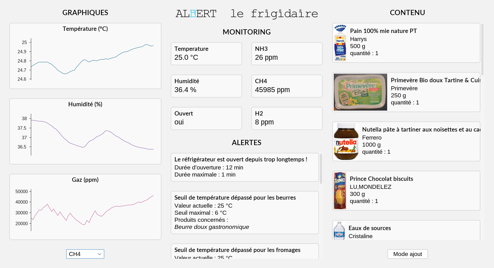

# Albert le frigidaire

A box to monitor your fridge without having to buy an expensive smart fridge.

This project made by six INSA Lyon students for a second year class. It uses Arduino (C++) for the hardware, MySQL to store data and Java for the graphical interface.

## Concept

The goal of the project is to make an inexpensive box that you can put in your fridge to monitor it from an application. The final result is the white box above, along with the monitoring app.

The box has many sensors to collect data on the temperature, the humidity, the concentration of six gases and the light itensity to know if the fridge is open. The app displays graphs of those values and give you alerts when certain thresholds are crossed, for example if the temperature is too high, or the fridge has been open for too long.

The box also have a barcode reader, to scan the products you put into your fridge. There is a button to set if you are adding or removing products. This way, the app has an up-to-date list of the products in your fridge, and can display informations about them, provided by the [Open Food Facts](https://world.openfoodfacts.org/) database. In addition, sensors theresholds dynamically adapt to the contents of your fridge.

## Project structure

The project is divided into four parts, which correspond to the four folders of the repository. The overly complex strcuture was imposed by the assignement.

+ [Box](Box) : the first Arduino chip with all the sensors, directly in the box.
+ [Receptor](Receptor) : a second Arduino chip that communicates with the first one through radio waves.
+ [Transfer](Transfer) : a Java app on a first computer to collect the data of the chip through a serial port, and store it in a distant SQL database.
+ [Dashboard](Dashboard) : a Java app on another computer that fetches informations from the database and displays them.

The code for the Arduino chips are PlatformIO projects, in C++. The Java apps are Maven projects, and the graphical interface was done painfully with Swing.

## Hardware

+ Chip : Arduino Uno ([supplier](https://store-usa.arduino.cc/products/arduino-uno-rev3), [documentation](https://docs.arduino.cc/))
+ Temperature : Thermistance CTN, Farnell ([supplier](https://fr.farnell.com/c/protections-electriques/thermistances/thermistances-ctn-de-compensation-mesure-de-temperature?st=thermistance%20ctn%2010%20Kohms))
+ Luminosity : Light Sensor Module, FlyingFish ([supplier](https://www.makerfabs.com/light-sensor-module.html), [tutorial](https://create.arduino.cc/projecthub/ingo-lohs/light-sensing-with-the-flying-fish-series-from-mh-0e51ab))
+ Humidity : Si7021 Temperature & Humidity Sensor, Adafruit ([supplier](https://www.adafruit.com/product/3251), [datasheet](https://cdn-learn.adafruit.com/assets/assets/000/035/931/original/Support_Documents_TechnicalDocs_Si7021-A20.pdf), [tutorial](https://cdn-learn.adafruit.com/downloads/pdf/adafruit-si7021-temperature-plus-humidity-sensor.pdf))
+ Gases : Grove Multichannel Gas Sensor, GoTronic ([supplier](https://www.gotronic.fr/art-capteur-de-gaz-grove-101020088-23825.htm#complte_desc), [datasheet](https://wiki.seeedstudio.com/Grove-Multichannel_Gas_Sensor/))
+ Barcode : Module lecteur de codes-barres 14810, GoTronic ([supplier](https://www.gotronic.fr/art-module-lecteur-de-codes-barres-14810-34233.htm#complte_desc), [datasheet](https://www.gotronic.fr/pj2-barcode-scanner-module-setting-manual-en-2641.pdf))
